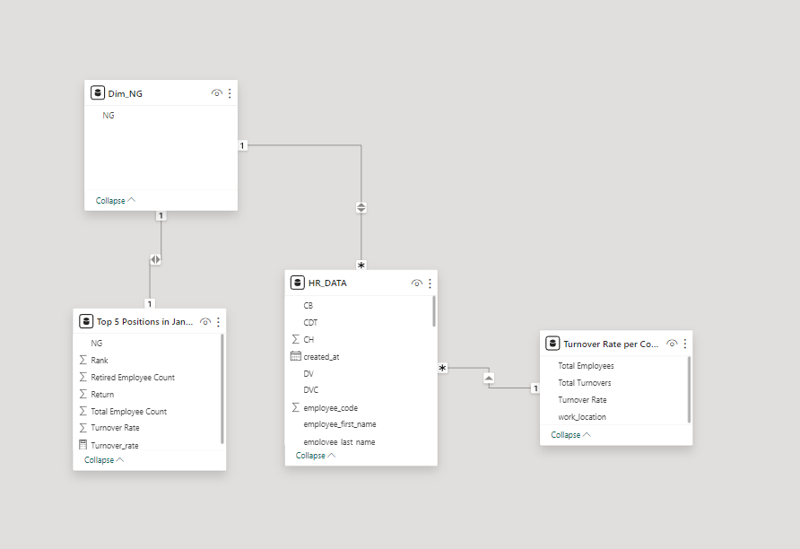
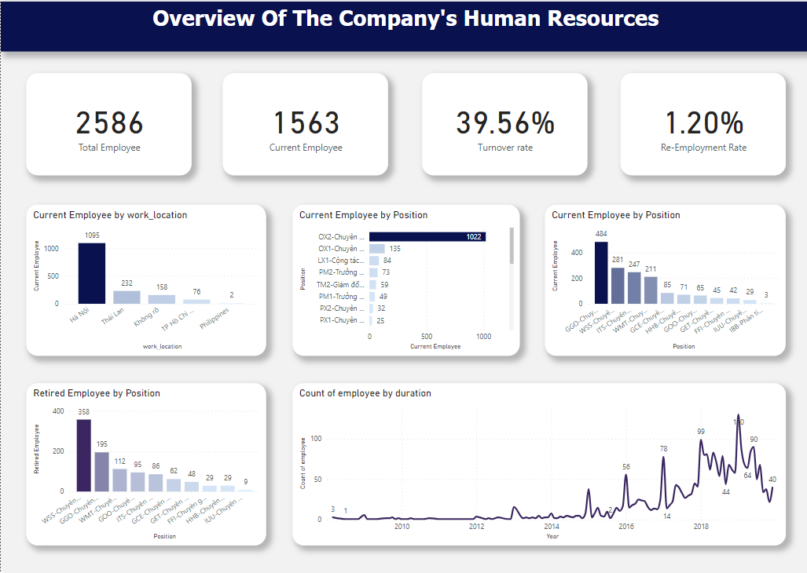

# HR Analysis

# Introduction

In the intricate landscape of Human Resources Management, our study is particularly focused on the pivotal subject of "Employee Turnover Analysis." This targeted emphasis is carefully chosen to dissect and understand the multifaceted nature of employee attrition and retention through a detailed segmentation approach. Anchoring our analysis is the robust dataset provided by Topica Ed Tech, a rich repository of information that we plan to meticulously analyze to discern patterns and trends in employee turnover.

# Topic Overview

Our objective is to leverage this data to identify key factors that contribute to turnover rates, understand how they vary across different employee clusters, and propose strategic interventions to foster a stable and engaged workforce. Through this initiative, we aspire to provide actionable insights that can significantly reduce turnover and cultivate a more committed and productive organizational environment.

# Data Exploration

Our exploration begins with the "HR_DATA" table, examining metrics like department, division, and employment duration to understand turnover patterns within Topica. The "Turnover Rate per Company Location" allows us to assess the turnover geographically, identifying if certain regions are more affected. Additionally, the "Dim_NG" and "Top 5 Positions in January" focus on specific job roles and their turnover rates, potentially uncovering roles that may require more attention due to higher attrition rates. This targeted analysis of turnover by location and position sets the stage for deeper investigation into the root causes of employee departure.

# Data Design 

The diagram illustrates an HR database designed to analyze employee turnover. Central to this is the "HR_DATA" table, which connects employee details to other key tables. "Dim_NG" and "Top 5 Positions in January" appear to track turnover by job role and seniority, while "Turnover Rate per Company Location" suggests a focus on the geographic distribution of turnover rates. This schema effectively supports a multifaceted analysis of turnover, allowing for insights that can inform retention strategies.

# Data Mining Techniques Applied to HR Analytics

In our HR analytics project, we employ data mining techniques to identify patterns and gain deeper insights into employee turnover. By leveraging DAX (Data Analysis Expressions), we create calculated measures that allow us to quantify total employees, total turnovers, and calculate turnover rates across various dimensions, such as work locations and time periods.

The "Turnover Rate per Country" measure uses ADDCOLUMNS and SUMMARIZE functions to aggregate turnover data at the country level. This aids in recognizing high-turnover regions and prompts targeted investigations into causal factors.

Another DAX measure, "Top 5 Positions in January," employs CALCULATETABLE, SUMMARIZE, and RANKX functions to rank positions based on turnover rates within a specified timeframe. This helps in pinpointing roles that are at higher risk for turnover at critical times of the year.

By integrating these DAX measures into our data mining process, we derive actionable insights that support strategic HR decision-making, aimed at improving employee retention and satisfaction.

# Business Decision Support:
Our analytics project empowers HR decision-makers by uncovering critical workforce insights. With sophisticated data mining, we spotlight turnover trends and identify key areas for intervention, ultimately supporting strategic decisions to bolster retention and optimize talent management.

# BI dashboard

This dashboard serves as a potent tool for HR professionals, streamlining complex data into intuitive insights. It offers flexible, user-driven analysis options, exemplifying our strategic application of BI tools. This dedication to harnessing data underscores our pursuit of excellence in employee turnover and retention strategies.

# I****nsights, Challenges, and Recommendations****

**Insights:**

The HR analysis focused on the turnover rate within Company X offered profound insights into employee retention and turnover trends. Through comprehensive data analysis, we identified patterns that underline the primary reasons for employee departure and retention. A meticulously designed dashboard, developed using advanced analytics tools, illuminated key metrics including turnover rate, average tenure, and employee satisfaction scores. The use of histograms, scatter plots, and heat maps facilitated an in-depth understanding of factors influencing employee turnover, such as departmental differences, tenure lengths, and job roles. The analysis further segmented employees into various categories based on their tenure, job satisfaction, and reasons for leaving, providing a granular view of employee engagement and dissatisfaction levels.

**Challenges:**

The journey to these insights was not without its challenges. One of the main hurdles was ensuring the accuracy and integrity of HR data, which required extensive data cleaning and preparation efforts. Additionally, the integration of data from various HR systems into a coherent analysis posed significant challenges due to discrepancies in data formats and definitions. Another critical challenge was the dynamic nature of employee behavior and sentiment, which necessitated a flexible and nuanced approach to understand the factors behind turnover rates effectively.

**Recommendations:**

Enhanced Data Integrity: Implement comprehensive data governance practices, including regular audits and validations, to improve the quality and reliability of HR data.
Unified Data Ecosystem: Create a centralized data integration framework that consolidates information from various HR systems, facilitating a holistic analysis of employee data.
Predictive Analytics for Turnover: Leverage machine learning and predictive analytics to identify potential turnover risks before they materialize, enabling proactive retention strategies.
Dynamic Dashboard Improvements: Continually refine the analytics dashboard based on stakeholder feedback, incorporating interactive elements and real-time data to enhance decision-making.
By addressing these recommendations, Company X can lay a robust foundation for future HR analytics projects, ensuring a deeper understanding of employee turnover dynamics. This endeavor not only sheds light on the underlying causes of turnover but also paves the way for targeted retention strategies, ultimately fostering a more engaged and stable workforce.

# Reference 

**Report:** [Report]()

**BI Dashboard:** [PowerBI Dashboard](https://app.powerbi.com/groups/me/reports/5ebeef25-9c44-4ce1-b3a0-638253700d76?ctid=a7380202-eb54-415a-9b66-4d9806cfab42&pbi_source=linkShare)

